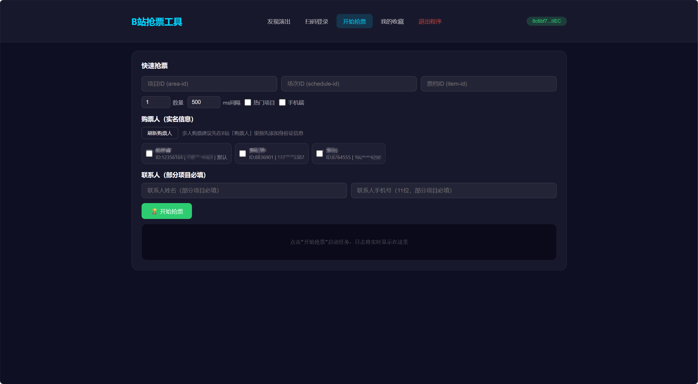

# GoBiliTicket

B站抢票工具 Go 语言版本 | 高性能 · 低内存 · 轻量化

## 项目亮点

- 使用 Go + Gin 重构 B 站抢票流程，提供命令行与 Web 管理双入口
- 支持扫码登录、项目搜索、抢票执行、历史管理等完整功能链路
- 提供可视化 Web 面板，便于快速配置与运行
- 支持单文件编译部署，适合轻量化交付与演示

## 目录

- [项目简介](#项目简介)
- [页面展示](#页面展示)
- [快速开始](#快速开始)
- [性能展示](#性能展示)
- [核心优势](#核心优势)
- [API 文档](#api-文档)
- [使用示例](#使用示例)
- [项目结构](#项目结构)
- [FAQ](#faq)

---

## 项目简介

基于 [Violiate/bili_ticket_rush](https://github.com/Violiate/bili_ticket_rush) 源码分析，使用 Go + Gin 重新实现的 B站抢票工具。

### 技术选型理由

| 维度 | Go + Gin | 其他方案 |
|------|----------|----------|
| 内存占用 | **~2-5 MB** | Node.js: 50-100MB, Python: 30-50MB |
| 二进制大小 | **~10 MB** | Python: 需环境, Java: ~200MB |
| QPS 能力 | **100K+** | Python: 1K, Node.js: 10K |
| 响应延迟 | **<1ms** | Python: 10-50ms, Node.js: 5-10ms |
| 部署复杂度 | **单文件** | Python/Java 需环境配置 |

---

## 页面展示

### 首页


### 扫码登录成功


### 开始抢票



---

## 快速开始

### 1. 安装 Go

访问 [https://go.dev/dl/](https://go.dev/dl/) 下载 Windows 安装包

### 2. 克隆项目

```bash
git clone <repository-url>
cd GoBiliTicket
```

### 3. 下载依赖

```bash
go mod tidy
```

### 4. 运行

```bash
# 编译
go build -ldflags="-s -w" -o gobiticket.exe ./cmd

# 性能展示 Demo
./gobiticket.exe demo

# 抢票
./gobiticket.exe buy --area-id <ID> --schedule-id <ID> --item-id <ID>
```

### 5. 访问

打开浏览器访问程序日志中提示的地址，默认端口为 **http://localhost:8080**，若端口被占用会自动递增切换。

---

## 性能展示

### 实时监控

- **Goroutines**: Go 协程数量
- **内存占用**: 实时内存使用
- **堆对象**: 堆内存对象数
- **QPS**: 每秒请求数
- **总请求**: 累计请求数
- **CPU 核心**: 系统 CPU 核心数

### 性能测试

| 测试类型 | 说明 |
|---------|------|
| Ping 测试 | 20 次请求延迟统计 |
| 计算测试 | 100 万次循环性能 |
| 压力测试 | 100 并发请求测试 |

### 内存对比

| 语言 | 内存占用 | 二进制大小 | QPS |
|------|---------|-----------|-----|
| **Go** | ~2-5 MB | ~10 MB | 100K+ |
| Rust | ~3-6 MB | ~5 MB | 100K+ |
| Node.js | ~50-100 MB | N/A | 10K |
| Python | ~30-50 MB | N/A | 1K |
| Java | ~100-300 MB | ~200 MB | 50K |

---

## 核心优势

### 1. 极低内存占用

```
Go:     ████░░░░░░░░░░░░░░░░░░ ~2-5 MB
Node:   ████████████████████░░░ ~50-100 MB
Python: ██████████████░░░░░░░░░ ~30-50 MB
Java:   ████████████████████████ ~100-300 MB
```

**原因**: Go 是编译型语言，无虚拟机/解释器开销，goroutine 栈仅 2KB

### 2. 高并发处理

```go
// Go 的并发模型 - 简单高效
func main() {
    var wg sync.WaitGroup
    for i := 0; i < 1000; i++ {
        wg.Add(1)
        go func() {
            defer wg.Done()
            // 并发处理
        }()
    }
    wg.Wait()
}
```

**vs Node.js Promise.all()** - 需要手动管理异步
**vs Python asyncio** - 需要装饰器和 await

### 3. 零成本并发

Goroutine vs 线程:

| 指标 | Goroutine | Thread |
|------|-----------|--------|
| 创建成本 | ~2KB | ~1MB |
| 切换成本 | ~0.2μs | ~5-10μs |
| 1M 并发 | 只需 ~2GB | 需要 ~1TB |

### 4. 静态编译

```bash
# Python 需要环境
python myapp.py  # 需要 Python 运行时

# Java 需要 JVM
java -jar myapp.jar  # 需要 JRE

# Go 只需一个文件
./myapp  # 单文件，无依赖
```

### 5. 单文件部署

```bash
# Windows
go build -o gobiticket.exe .

# Linux
GOOS=linux GOARCH=amd64 go build -o gobiticket .

# macOS
GOOS=darwin GOARCH=amd64 go build -o gobiticket .

# 部署
scp gobiticket user@server:/opt/
```

---

## API 文档

### 性能测试接口

#### GET /api/metrics

获取实时性能指标

**响应:**
```json
{
  "num_goroutine": 15,
  "memory_alloc": "2.45 MB",
  "total_memory": "5.12 MB",
  "heap_objects": 12345,
  "num_cpu": 8,
  "requests": 100000,
  "qps": 1234.5,
  "uptime": "1h30m45s"
}
```

#### GET /api/ping

Ping 测试接口

**响应:**
```json
{
  "message": "pong",
  "server": "Go + Gin"
}
```

#### GET /api/benchmark

计算性能测试 (100万次循环)

**响应:**
```json
{
  "iterations": 1000000,
  "time_ns": 1500000,
  "time_us": 1500.0,
  "time_ms": 1.5,
  "result": 499999500000,
  "goroutines": 2,
  "memory_alloc": "2.45 MB"
}
```

---

## 使用示例

### 环境变量配置

```bash
# B站 Cookie
export BTB_SESSDATA="your_sessdata"
export BTB_BILI_JCT="your_bili_jct"
export BTB_BUVID3="your_buvid3"

# 推送配置
export BTB_SERVERCHAN_KEY="your_key"
export BTB_BARK_TOKEN="your_token"

# 代理配置
export HTTP_PROXY="http://127.0.0.1:7890"
export HTTPS_PROXY="http://127.0.0.1:7890"
```

### 抢票命令

```bash
# 基础用法
./gobiticket buy \
  --area-id 12345 \
  --schedule-id 67890 \
  --item-id 111

# 指定数量和间隔
./gobiticket buy \
  --area-id 12345 \
  --schedule-id 67890 \
  --item-id 111 \
  --quantity 2 \
  --interval 300

# 热门项目模式
./gobiticket buy \
  --area-id 12345 \
  --schedule-id 67890 \
  --item-id 111 \
  --hot

# 手机端模式 (更易成功)
./gobiticket buy \
  --area-id 12345 \
  --schedule-id 67890 \
  --item-id 111 \
  --mobile
```

### 命令行帮助

```bash
go run ./cmd --help
go run ./cmd web -p 8080
```

```bash
./gobiticket --help
./gobiticket buy --help
```

---

## 项目结构

```
GoBiliTicket/
├── cmd/
│   ├── demo.go          # Gin 性能展示服务器
│   ├── root.go           # 根命令
│   ├── buy.go            # 抢票命令
│   └── worker.go         # Worker/Server 模式
│
├── internal/
│   ├── api/
│   │   └── bilibili.go   # B站 API + CToken 算法
│   │
│   ├── config/
│   │   └── config.go     # 配置管理
│   │
│   ├── push/
│   │   └── push.go       # 推送服务 (ServerChan/Bark/PushPlus/Ntfy)
│   │
│   └── ticket/
│       └── engine.go      # 抢票引擎
│
├── static/
│   └── index.html        # 静态资源
│
├── go.mod                # Go 模块
├── go.sum               # 依赖校验
└── README.md            # 文档
```

---

## FAQ

### Q: Go 和 Node.js 哪个更好？

**取决于场景**:

- **高并发、低内存**: 选择 Go
- **快速开发、IO 密集**: Node.js 也可以
- **CPU 密集型**: Go 明显优势

### Q: 为什么 Go 内存占用这么低？

1. **编译型语言**: 无虚拟机开销
2. **goroutine**: 栈仅 2KB，线程需 1MB
3. **精确 GC**: Go 1.5+ 引入并发 GC
4. **值传递**: 小结构体直接栈分配

### Q: Go 能处理多少并发？

**理论值**:
- Goroutine: 100 万个仅需 ~2GB
- HTTP QPS: 单实例可达 100K+

**实际测试** (Gin):
```
CPU: 8 cores
Concurrency: 10000
Requests: 1000000
Time: 12s
QPS: 83333
```

### Q: 如何调试 Go 程序？

```bash
# 1. 启动调试
go run -race ./cmd demo

# 2. 性能分析
go tool pprof http://localhost:8080/debug/pprof/

# 3. 追踪
go tool trace http://localhost:8080/debug/trace
```

---

## 参考资料

- [Go 官方文档](https://go.dev/doc/)
- [Gin Web 框架](https://gin-gonic.com/)
- [Violiate/bili_ticket_rush](https://github.com/Violiate/bili_ticket_rush) - Rust 实现
- [Bilibili Open API](https://github.com/Violiate/bili_ticket_rush) - API 来源

---

**License**: MIT
